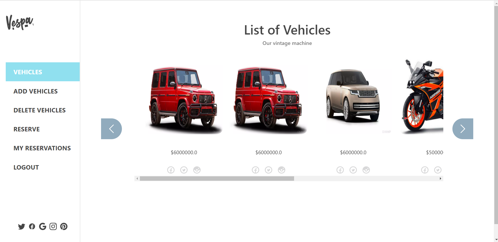

# Book Vehicle

> The Book Vehicle is a a React, Redux application based on the [back-end API-docs](https://book-vehicle.herokuapp.com/).

- In this application we're fetching the returned data from the API in the Redux store.

- The user can reserve a vehicle and it'll update the state automatically, , and also the user can add a vehicle in this application.

## Built With

- React
- Redux
- React Bootstrap
- HTML
- CSS
- Javascript
- node-modules
- lighthouse
- hintweb
- stylint
- eslint
- webpack
- web server
- plugins for HTML and CSS
## Screenshots

[sign in screen]

[Sign-up screen]

[Pop up window]

<!--  -->
[Vehicles screen]

[Add vehicles screen]

[Delete vehicle screen]

[Reserve a vehicle screen]

[My reservation screen]

## Live Demo

- [Live Demo Link](https://thriving-chebakia-dd687f.netlify.app/login)

## Link to Back-end repo
- https://github.com/Fatima-hub333/appointment-diary-backend

## Getting Started

To get a local copy up and running follow these simple steps:

- Copy this link `https://github.com/Fatima-hub333/appointment-diary-front-end.git`.
- Get the directory that you want to clone the repository.
- Open the command prompt in this directory.
- Write `git clone https://github.com/Fatima-hub333/appointment-diary-front-end.git`.
- Go to the repository folder in your command prompt, run `cd 
appointment-diary-front-end
`.
- Run `npm install`

### Prerequisites

1. NodeJS
2. NPM

### Build

Type these commands into the terminal:

- npm run build
- Open dist/index.html in your web browser.

### Run the application in local environment

Type this command in your terminal

- npm run start
- Your web browser will open on localhost

### Run tests

Type this command into the terminal:

- npm run test

## Authors

👤 **Bassem Shams**

- GitHub: [@basem909](https://github.com/basem909)
- Twitter: [@ShamsBassem](https://twitter.com/ShamsBassem)
- LinkedIn: [Bassem Abdelrahman](https://www.linkedin.com/in/bassem-shams-126a29134/)

👤 **Isaac maqueen**

- GitHub: [@kinginthenorthcodez](https://github.com/kinginthenorthcodez)
- Twitter: [@kinginthenorthcodez](https://twitter.com/kinginthenorthcodez)

👤 **Fatima Zahir**

- GitHub: [@githubhandle](https://github.com/Fatima-hub333)
- Twitter: [@twitterhandle](https://twitter.com/Fatima_developr)
- LinkedIn: [LinkedIn](https://www.linkedin.com/in/fatimaa-zahir/)

## 🤝 Contributing

Contributions, issues, and feature requests are welcome!

## Show your support

Give a ⭐️ if you like this project!

## Acknowledgments

- [Original design idea by Murat Korkmaz on Behance.](https://www.behance.net/gallery/26425031/Vespa-Responsive-Redesign) 

## 📝 License

This project is [MIT](./MIT.md) licensed.
